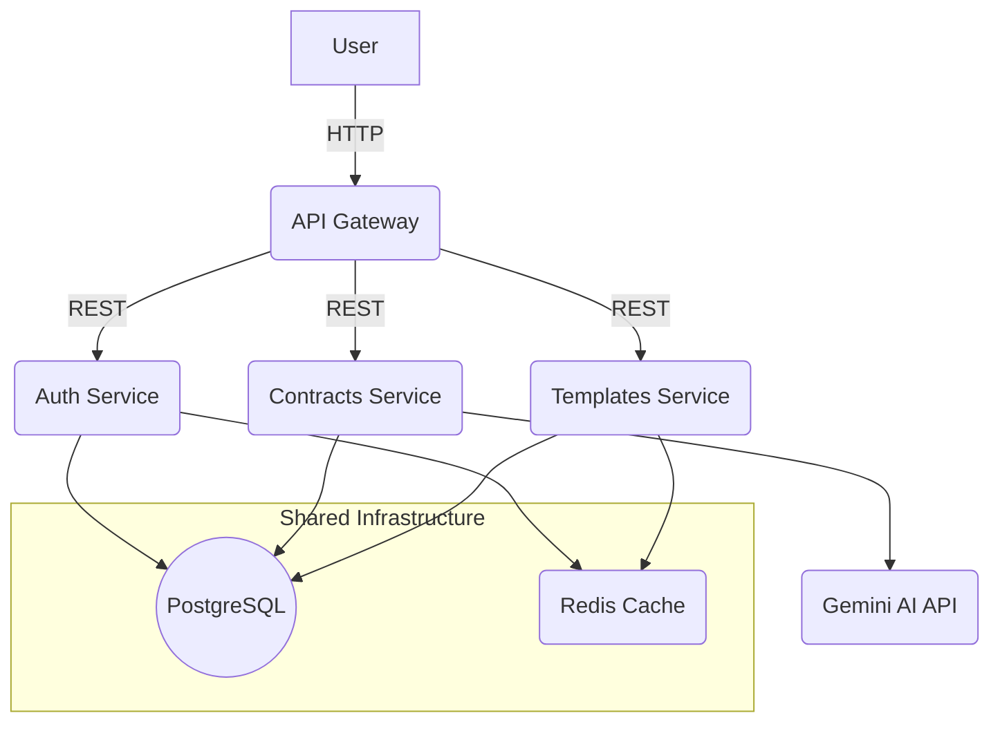

# ⚖️ Automated Legal Contract Generation System


[](https://github.com/your-org/your-repo/actions)
[](https://github.com/your-org/your-repo/actions)
[](LICENSE)

---

> **Confidentiality & Independence Notice**
>
> This repository is a brand new, from-scratch version inspired by a commercial project originally developed for one of my clients. The original system was built with a different technology stack. I have explicit authorization to use only the core idea of the system; all other aspects—such as the technology stack, methods, and designs—are entirely different and open source. For confidentiality and security reasons, this project does not share any technical or technological similarity with the original, nor does it reveal any information about the client’s proprietary solution. This is an independent adaptation using a different stack, fully respecting all confidentiality agreements and client security requirements.

**A robust, scalable, and secure platform designed to automate the lifecycle of legal contract creation using a microservices architecture.**


---


## 📑 Table of Contents

- [The Problem](#-the-problem)
- [Our Solution](#-our-solution)
- [Architecture](#-architecture-a-microservices-approach)
- [Project Structure](#-project-structure)
- [Technology Stack & Rationale](#-technology-stack--rationale)
- [Getting Started](#-getting-started-running-locally)
- [Development Checklist & Project Scope](#-development-checklist--project-scope)
- [Monitoring & Health Checks](#-monitoring--health-checks)
- [Demo](#-demo)
- [Contributing](#-contributing)
- [Credits](#-credits)
- [License](#-license)
- [FAQ](#-faq)
- [Author](#-author)

---

## 🎯 The Problem

The traditional process of drafting legal contracts is fraught with inefficiencies and risks:

* **Manual Effort:** Legal professionals spend countless hours on repetitive drafting and data entry.
* **Human Error:** Minor mistakes in names, dates, or clauses can lead to significant legal and financial repercussions.
* **Inconsistency:** Maintaining brand and legal consistency across hundreds of documents is a major challenge.
* **Compliance Risk:** Ensuring every contract adheres to the latest regulations is a complex, ongoing task.

---

## 💡 Our Solution

This system provides a centralized platform for law firms and legal teams to generate complex, precise, and compliant legal documents automatically. By leveraging a powerful backend, an intelligent AI integration, and a dynamic frontend, we transform the contract management workflow, enabling users to focus on high-value legal work rather than administrative tasks.

---

## 🏛️ Architecture: A Microservices Approach
For this system, we've chosen a **distributed microservices architecture**. Even for local demonstration, this pattern is crucial for showcasing the ability to build scalable, resilient, and independently deployable systems.

### Why Microservices?

* **Scalability:** Each business domain (authentication, templates, contract generation) is an independent service that can be scaled individually.
* **Resilience:** A failure in one service (e.g., template management) won't crash the entire application, ensuring high availability for critical functions.
* **Technology Flexibility:** It allows each service to use the best technology for its specific job.
* **Independent Deployment:** Enables rapid iteration and deployment of features for a single service without affecting the rest of the system.


### System Diagram



---

## 🗂️ Project Structure

```text
automated-legal-contract-generation/
├── apps/
│   ├── api-gateway/           # API Gateway service
│   ├── auth-service/          # Authentication service
│   ├── contracts-service/     # Contract generation service
│   ├── templates-service/     # Template management service
│   └── web/                   # Next.js frontend application
├── packages/
│   ├── dtos/                  # Shared data transfer objects
│   ├── utils/                 # Shared utilities
│   ├── config/                # Shared configuration
│   ├── middleware/            # Shared middleware
│   ├── eslint-config-custom/  # Custom ESLint configuration
│   ├── tsconfig/              # Shared TypeScript configuration
│   └── ui/                    # Shared UI components
├── grafana/
│   └── provisioning/          # Grafana dashboards and datasources
├── scripts/
│   ├── migrate.sh             # Database migration script
│   ├── seed.sh                # Database seeding script
│   └── wait-for-it.sh         # Service wait script
├── Dockerfile                 # 🚀 Unified Docker configuration
├── docker-compose.yml         # Multi-container orchestration
├── nginx.conf                 # Reverse proxy configuration
├── prometheus.yml             # Monitoring configuration
├── package.json               # Root package configuration
├── pnpm-workspace.yaml        # PNPM workspace configuration
└── README.md                  # You are here!
```

---


## 🛠️ Technology Stack & Rationale

### Backend Services (NestJS)
- **Why NestJS?** A progressive Node.js framework with TypeScript support, modular architecture, and first-class support for scalable microservices.
- **Linting & Formatting:**
    - [ESLint](https://eslint.org/) with `@typescript-eslint` for code quality and best practices.
    - [Prettier](https://prettier.io/) for consistent code formatting.
    - [Husky](https://typicode.github.io/husky/) and [lint-staged](https://github.com/okonet/lint-staged) for pre-commit hooks.
    - [Commitlint](https://commitlint.js.org/) and [Commitizen](https://commitizen.github.io/cz-cli/) for conventional commit messages.
- **Testing:** [Jest](https://jestjs.io/) for unit and integration tests.

### Frontend Application (Next.js)
- **Why Next.js?** The leading React framework, offering SSR, API routes, and a superior developer experience.
- **UI Library:** [shadcn/ui](https://ui.shadcn.com/) for modern, accessible, and customizable components.
- **State Management:** [Zustand](https://zustand-demo.pmnd.rs/) for simple, scalable state; [Redux Toolkit](https://redux-toolkit.js.org/) for advanced needs.
- **Authentication:** [NextAuth.js](https://next-auth.js.org/) for secure, extensible authentication (JWT, OAuth, credentials), with HTTP-only cookies and protected routes.
- **Linting & Formatting:** ESLint, Prettier, Husky, lint-staged, Commitlint, and Commitizen as in backend.
- **Testing:** Jest and React Testing Library.
    - `src/app/` — App Router, API routes, and main pages.
    - `src/components/` — Reusable UI components.
    - `src/features/` — Feature-based modules (e.g., auth, contracts, templates).
### Authentication (Frontend & Backend)
- **Frontend:**
    - NextAuth.js for authentication, with pages `/login`, `/register`, `/logout`, and middleware for route protection.
    - Secure token storage via HTTP-only cookies.
- **Backend:**
    - JWT authentication and RBAC in all NestJS services.
    - Auth Service for issuing/validating JWTs and user management.
    - API Gateway for global JWT validation and user context propagation.

### API Gateway & NGINX
- **API Gateway:** Centralizes authentication, request routing, and aggregation (BFF pattern).
- **NGINX:** Used as a reverse proxy in local and production environments for:
    - Routing traffic to frontend and API Gateway.
    - SSL termination, rate limiting, and logging.
    - Example config: `nginx.conf` in project root.

### Best Practices
- **Type Safety:** End-to-end type safety using shared DTOs and types in `/packages/dtos` and `/packages/types`.
- **Testing:** Unit and integration tests with Jest for backend and frontend.
- **Linting & Formatting:** Consistent enforcement across all codebases.
- **CI/CD:** GitHub Actions for lint, test, build, and Docker image publishing.
- **Security:** Helmet, CORS, rate limiting, secure cookies/sessions, and best practices by default.
- **Observability:** All services expose `/metrics` for Prometheus and health endpoints for orchestration.

### Database & Cache
- **PostgreSQL:** Robust, reliable, and supports schema-per-service for logical isolation.
- **Redis:** Shared in-memory cache for sessions, templates, and performance.

### Infrastructure (Docker & Compose)
- **Docker:** Single unified Dockerfile with ARG-based service selection for consistent containerization across all services.
- **Docker Compose:** Orchestrates multi-container local environments, including databases, cache, monitoring, and reverse proxy.
- **Unified Build Process:** All services use the same base Dockerfile with conditional builds based on service type (NestJS/Next.js).

### Monitoring
- **Prometheus & Grafana:** Prometheus scrapes metrics from all services; Grafana provides dashboards for system health and performance.

---

## 🐳 Unified Docker Architecture

This project implements a **unified Docker strategy** using a single `Dockerfile` at the root level that dynamically builds different services based on build arguments.

> **📋 Current Strategy:** This unified approach is optimal for development and initial deployment. Future optimization may involve service-specific Dockerfiles (see Phase 5 roadmap).

### Key Benefits
- **Consistency:** All services use the same base image and build process
- **Maintainability:** Single source of truth for Docker configuration  
- **Efficiency:** Shared layers across services reduce storage requirements
- **PNPM Optimization:** Native support for PNPM workspaces in containers
- **Development Speed:** Faster iteration and unified troubleshooting
- **Deployment Simplicity:** Easier to manage in early project phases

### How It Works

The root `Dockerfile` uses build arguments to determine which service to build:

```yaml
# Example from docker-compose.yml
auth-service:
  build:
    context: .
    dockerfile: Dockerfile
    args:
      SERVICE_NAME: auth-service
      SERVICE_TYPE: nestjs
  environment:
    - SERVICE_TYPE=nestjs
```

### Supported Service Types
- **`nestjs`**: For backend microservices (auth, contracts, templates, api-gateway)
- **`nextjs`**: For the frontend web application

### Build Process
1. **Base Stage:** Installs Node.js and PNPM
2. **Dependencies:** Installs all workspace dependencies
3. **Build Stage:** Builds the specific service using PNPM
4. **Runtime:** Copies built artifacts and starts the service

---


## 🚀 Getting Started

Follow these steps to set up and run the entire microservices ecosystem on your local machine.

### Prerequisites

- Node.js (v18.x or later)
- PNPM (`npm install -g pnpm`)
- Docker & Docker Compose

### Step-by-Step Installation

1. **Clone the Repository**
    ```bash
    git clone https://github.com/Miguel-DevOps/automated-legal-contract-generation.git
    cd automated-legal-contract-generation
    ```
2. **Install Dependencies**
    ```bash
    pnpm install
    ```
3. **Configure Environment Variables**
    ```bash
    cp .env.example .env
    # Edit .env as needed
    ```
4. **Launch the Entire Stack**
    ```bash
    docker-compose up --build
    ```

### Access the Services

#### 🌐 **Directly Accessible via Browser:**
- **Nginx Reverse Proxy:** http://localhost:80 ✅ (Production-like setup)
- **Frontend Application:** http://localhost:3000 ✅ (Direct access)
- **Auth Service Health Check:** http://localhost:3001/health ✅
- **Grafana Dashboard:** http://localhost:3010 ✅ (admin/admin)
- **Prometheus UI:** http://localhost:9090 ✅

#### 🌐 **Via Nginx Reverse Proxy (Recommended):**
- **Full Application:** http://localhost ✅ (Serves Next.js frontend)
- **API Endpoints:** http://localhost/api/* ✅ (Routes to API Gateway)

#### 🛡️ **Internal Services (Not directly accessible):**
- **API Gateway:** Internal port 4000 (access via Nginx /api/)
- **Contracts Service:** Internal port 3002 (access via API Gateway)
- **Templates Service:** Internal port 3003 (access via API Gateway)

#### 🗄️ **Infrastructure Services:**
- **PostgreSQL:** localhost:5432 (Database - use DB client)
- **Redis:** localhost:6379 (Cache - use Redis client)

> **Note:** The microservices (API Gateway, Contracts, Templates) are designed to be accessed through the Frontend application or API Gateway, not directly from the browser. This follows microservices security best practices.

---


---

## ✅ Development Checklist & Project Scope

This checklist outlines the detailed tasks required to build this project from the ground up. It serves as the main roadmap for development.

### Phase 1: Foundation & DevOps Setup ✅
- [ ] Initialize PNPM monorepo with pnpm-workspace.yaml.
- [ ] Set up the root package.json with global scripts.
- [ ] Create the project folder structure (/apps, /packages).
- [ ] Define the full multi-container environment in docker-compose.yml.
- [ ] Create a unified, multi-stage Dockerfile for all services.
- [ ] Configure Prometheus and Grafana in Docker Compose.
- [ ] Set up shared ESLint and TypeScript configurations in the /packages directory.

### Phase 2: Core Backend Services ✅

**Auth Service (apps/auth-service)** ✅
- [ ] Initialize NestJS project.
- [ ] Create User entity (PostgreSQL/TypeORM).
- [ ] Implement AuthModule with registration and login logic.
- [ ] Implement JWT strategy for authentication using Passport.js.
- [ ] Create UsersController and UsersService for user management.
- [ ] Define DTOs (Data Transfer Objects) for requests and responses.

**Templates Service (apps/templates-service)** 🚧
- [ ] Initialize NestJS project.
- [ ] Create Template and Clause entities.
- [ ] Implement CRUD functionality for managing contract templates.
- [ ] Implement logic for dynamic template variables (e.g., {{clientName}}).
- [ ] Implement Redis caching for frequently accessed templates.

**Contracts Service (apps/contracts-service)** 🚧
- [ ] Initialize NestJS project.
- [ ] Create Contract entity to store generated document metadata.
- [ ] Develop the core contract generation engine.
- [ ] Integrate with Gemini API for intelligent data processing or clause suggestions.
- [ ] Implement PDF generation logic (e.g., using puppeteer).
- [ ] Define logic for contract lifecycle (draft, signed, archived).

### Phase 3: Gateway & Frontend ✅

**API Gateway (apps/api-gateway)** ✅
- [ ] Initialize NestJS project.
- [ ] Set up routes to proxy requests to the appropriate microservices.
- [ ] Implement a global authentication guard that validates JWTs passed from the client.
- [ ] Aggregate data from multiple services for specific frontend needs (BFF Pattern).

**Web Frontend (apps/web)** ✅
- [ ] Initialize Next.js project with TypeScript.
- [ ] Implement a global state management solution (e.g., Zustand, Redux Toolkit).
- [ ] Create authentication pages (Login, Register).
- [ ] Build the main dashboard UI.
- [ ] Develop the contract creation wizard/form interface.
- [ ] Create a view to display and download generated contracts.

### Phase 4: Integration & Finalization 🚧
- [ ] Establish communication between services (e.g., using RabbitMQ for events or simple HTTP calls for synchronous needs).
- [ ] Implement observability: add a /metrics endpoint to all NestJS services for Prometheus to scrape.
- [ ] Create a basic Grafana dashboard to visualize key service metrics (e.g., request latency, error rates).
- [ ] Write comprehensive unit and integration tests for all critical business logic.
- [ ] Perform a final security review (check for common vulnerabilities like SQL injection, XSS).
- [ ] Write documentation for API endpoints (e.g., using Swagger in NestJS).

### Phase 5: Advanced Optimization & Scalability 🎯

> **⚠️ Important:** These are advanced optimizations that should only be implemented after the core system is stable and functioning. The current unified Dockerfile approach is excellent for development and initial deployment.

- [ ] **Independent Dockerfiles:** Refactor from unified Dockerfile to service-specific Dockerfiles for better isolation, independent scaling, and optimized build caches per service.
  - **Why later?** Current unified approach provides consistency and maintainability during development
  - **When to do?** When services have different optimization needs or deployment patterns
  - **Benefits:** Smaller images, faster builds, service-specific optimizations, independent deployment cycles

- [ ] **Multi-stage optimization:** Implement advanced multi-stage builds with service-specific optimizations (e.g., different base images for Node.js services vs Next.js frontend).
- [ ] **Container image optimization:** Minimize image sizes using Alpine variants, .dockerignore files, and layer optimization techniques.
- [ ] **Kubernetes manifests:** Create K8s deployment files for production container orchestration and auto-scaling.
- [ ] **Advanced monitoring:** Implement distributed tracing (e.g., Jaeger) and service mesh (e.g., Istio) for microservices observability.
- [ ] **Performance optimization:** Add Redis caching layers, database connection pooling, and API response caching strategies.
- [ ] **CI/CD pipeline:** Set up GitHub Actions for automated testing, security scanning, and multi-environment deployments.e.svg

---


---

---
## 🖥️ Demo

> _A visual demo (screenshots/GIF) will be added here as the project progresses._

---


---

---
## 🤝 Contributing

> **Note:** External contributions are not accepted at this stage. Contribution guidelines and code of conduct will be published once the project reaches a stable release.

---


---

## 🙏 Credits

- [Gemini AI API](https://ai.google.dev/gemini-api)
- [NestJS](https://nestjs.com/)
- [Next.js](https://nextjs.org/)

---


---

## 📄 License

MIT © Miguel Lozano

---


---

## ❓ FAQ

- **Why use PNPM instead of NPM/Yarn?**  PNPM is faster and more efficient for large monorepos.
- **How do I restore the database?**  Use the scripts in `/scripts` or check each service's documentation.

---


---

## 📊 Monitoring & Health Checks

All microservices and the frontend expose standard endpoints for monitoring and health checks:

### Available Endpoints

| Service             | Health Check                | Metrics                    | Browser Access          |
|---------------------|----------------------------|----------------------------|------------------------|
| Auth Service        | `http://localhost:3001/health` ✅ | `http://localhost:3001/metrics` ✅ | **Direct Access** |
| Contracts Service   | Internal `/health` 🔒       | Internal `/metrics` 🔒     | **Via API Gateway** |
| Templates Service   | Internal `/health` 🔒       | Internal `/metrics` 🔒     | **Via API Gateway** |
| API Gateway         | Internal `/health` 🔒       | Internal `/metrics` 🔒     | **Via Frontend** |
| Frontend (Next.js)  | `http://localhost:3000/api/health` ✅ | `http://localhost:3000/api/metrics` ✅ | **Direct Access** |

### Usage Example

```bash
# Check service status
docker-compose ps

# Auth Service health check (directly accessible)
curl http://localhost:3001/health

# Frontend health check (directly accessible)
curl http://localhost:3000/api/health

# Internal services health (requires container access)
docker-compose exec contracts-service curl http://localhost:3002/health
docker-compose exec templates-service curl http://localhost:3003/health
docker-compose exec api-gateway curl http://localhost:4000/health

# Contracts Service metrics
curl http://localhost:3002/metrics

# View service logs
docker-compose logs auth-service

# Rebuild and restart all services
docker-compose up --build -d
```

These endpoints can be consumed by Prometheus, Grafana, orchestration systems, or for manual testing.

---

## 🔌 Port Configuration & Access

### Understanding Port Mapping

This project uses **strategic port exposure** for security and performance:

#### 🌐 **Publicly Mapped Ports (Browser Accessible):**
```yaml
# These services are accessible from your host machine
ports:
  - "80:80"       # Nginx reverse proxy (RECOMMENDED)
  - "3000:3000"   # Frontend Next.js app (direct access)
  - "3001:3001"   # Auth service (health checks)
  - "3010:3000"   # Grafana dashboard
  - "9090:9090"   # Prometheus monitoring
  - "5432:5432"   # PostgreSQL database
  - "6379:6379"   # Redis cache
```

#### 🔒 **Internal Exposed Ports (Container Network Only):**
```yaml
# These services are only accessible within Docker network
expose:
  - "4000"  # API Gateway
  - "3002"  # Contracts Service  
  - "3003"  # Templates Service
```

### Why This Architecture?

- **Security:** Internal services are not directly accessible from outside
- **Performance:** Reduces attack surface and improves container communication
- **Scalability:** Services communicate through the Docker network efficiently
- **Best Practices:** Follows microservices security patterns

### Quick Access Guide

| What you want to do | Recommended URL | Alternative URL |
|---------------------|----------------|-----------------|
| **Use the application** | http://localhost ✅ | http://localhost:3000 |
| **Access API endpoints** | http://localhost/api/* ✅ | N/A (use Nginx) |
| **Check system health** | http://localhost:3001/health | N/A |
| **View system metrics** | http://localhost:9090 | N/A |
| **Access monitoring dashboard** | http://localhost:3010 | N/A |
| **Connect to database** | localhost:5432 (use DB client) | N/A |

> **💡 Pro Tip:** Use http://localhost (port 80) for the complete application experience with proper API routing through Nginx reverse proxy.

---

## 🔧 Troubleshooting

### Common Issues

**Services not starting properly:**
```bash
# Check service status
docker-compose ps

# View logs for a specific service
docker-compose logs [service-name]

# Restart all services
docker-compose down && docker-compose up --build -d
```

**Port conflicts:**
- Make sure ports 3000-3003, 4000, 9090 are available
- Check `docker-compose.yml` for port mappings

**PNPM issues in containers:**
- All services now use unified Dockerfile with PNPM support
- If you encounter issues, try rebuilding: `docker-compose build --no-cache`

**Database connection issues:**
- Wait for PostgreSQL to be fully ready before services start
- The `wait-for-it.sh` script handles this automatically

### Health Check Status

All services expose health endpoints. A typical healthy response looks like:
```json
{
  "status": "ok",
  "service": "auth-service", 
  "timestamp": "2025-01-10T20:10:25.358Z"
}
```

---

## 👨‍💻 Author
**Miguel Lozano**  
Email: [miguel@developmi.com](mailto:miguel@developmi.com)  
LinkedIn: [miguel-dev-ops](https://www.linkedin.com/in/miguel-dev-ops/)

---